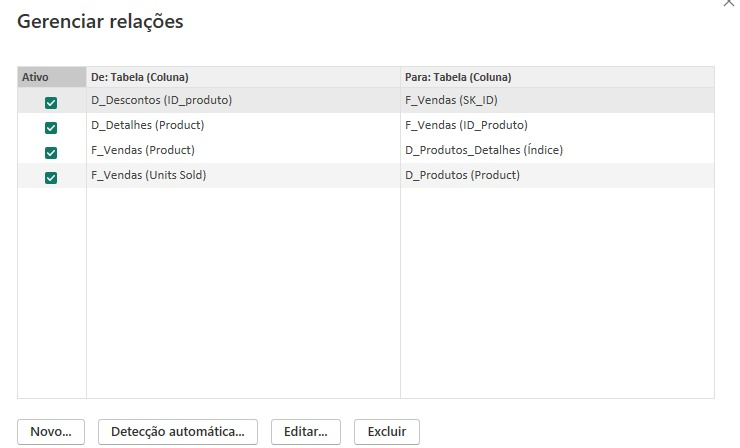

# Dashboard de E-commerce com Power BI

Este projeto consiste na criação de um dashboard de E-commerce utilizando Power BI, com foco em fórmulas DAX e transformação de dados.

## Objetivo

O objetivo deste dashboard é fornecer insights detalhados sobre as vendas de um E-commerce, permitindo uma análise aprofundada dos dados para tomada de decisões estratégicas.

## Transformação dos dados

1. Ajustes das tabelas fazendo os agrupamentos necessários e remoção da tabela 'finnancials' dos calculos, 
2. Agrupamentos de Product com Contagem, valores minimo, máximo, média e mediana, média da manufatura.
3. Adição da coluna Desconto total: 
    Table.AddColumn(#"Tipo Alterado", "Desconto total", each [Units Sold]*[Sale Price]- [Discounts])

## Relacionamentos

1. Exibição das relações após exclusão das relações e ocultação do finnancials:

2. Modelo final no star schema:
